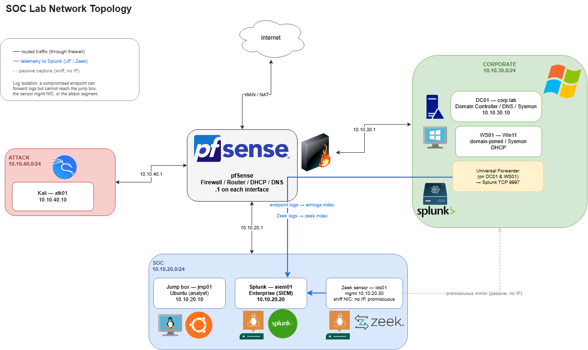
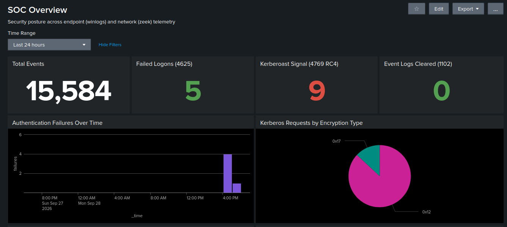
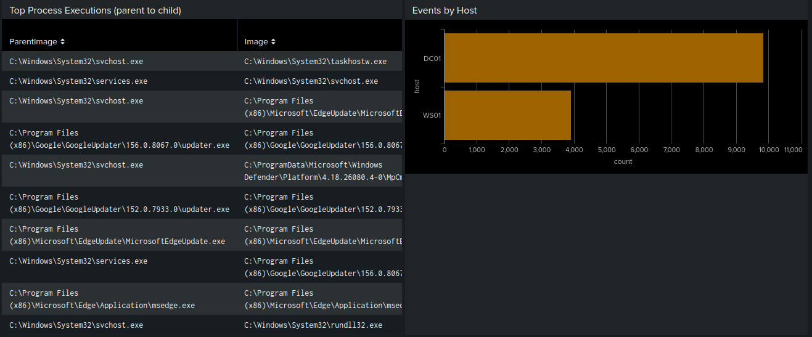

# SOC Detection Lab

A home SOC analyst lab built to practice the full detection lifecycle: build the telemetry
pipeline, run real attacks, write detections, and reconstruct intrusions from logs.

Everything here was built from scratch on VMware Workstation, attacked, detected, and
documented — including the mistakes and the gaps found along the way.

*The SOC Overview dashboard, correlating endpoint and network telemetry. The Kerberoast tile is
red because the attack was run live — the dashboard flags it without a manual search.*

---

## What this demonstrates

- **Detection engineering** — five tuned detections across the MITRE ATT&CK matrix (credential
  access, persistence, defense evasion, C2), spanning **both endpoint and network** data sources,
  each documented with its false positives and how they were tuned out.
- **Incident reconstruction** — a full six-stage intrusion executed end to end, then rebuilt
  from the logs alone by pivoting host to host back to patient zero. See
  [`attack-chain.md`](attack-chain.md).
- **Telemetry engineering** — Sysmon + Windows audit policy + PowerShell logging *and* a Zeek
  network sensor, forwarded to Splunk, with several real "configured but not actually logging"
  gaps found and fixed.
- **Network security** — segmented VLANs with least-privilege firewall policy and log isolation,
  plus the honest finding that a virtual network tap drops packets — so endpoint telemetry is the
  reliable backbone and network the complement. See
  [`docs/network-visibility.md`](docs/network-visibility.md).

---

## Architecture

A segmented network on VMware Workstation. The host has no adapter on any lab segment; all
management goes through an analyst jump box. The attacker segment is firewalled off from the
SIEM so a compromised attacker cannot reach the log store.

| VM | Role | Segment | IP |
|----|------|---------|-----|
| `fw01-pfsense` | Firewall / router / DHCP / DNS | all | .1 on each |
| `jmp01-ubuntu` | Analyst jump box | SOC `10.10.20.0/24` | .10 |
| `siem01-splunk` | Splunk Enterprise | SOC `10.10.20.0/24` | .20 |
| `dc01-winsrv` | Domain controller (`corp.lab`), DNS, Sysmon | Corp `10.10.30.0/24` | .10 |
| `ws01-win11` | Windows 11 client, domain-joined, Sysmon | Corp `10.10.30.0/24` | DHCP |
| `ids01-sensor` | Zeek network sensor (dual-NIC, promiscuous) | SOC mgmt `.30` + Corp sniff | .30 |
| `atk01-kali` | Attacker | Attack `10.10.40.0/24` | .10 |

**Telemetry paths:** endpoints → Universal Forwarder (TCP 9997) → Splunk `winlogs` index;
Zeek sensor → Universal Forwarder → Splunk `zeek` index. Firewall policy is least-privilege with
log isolation — a compromised endpoint can forward logs but cannot reach the jump box, the
sensor, or the attacker segment.

---

## Detections

| # | Detection | Tactic | Technique | Primary signal | Fidelity |
|---|-----------|--------|-----------|----------------|----------|
| 1 | [Kerberoasting](detections/T1558.003-kerberoasting.md) | Credential Access | T1558.003 | 4769 RC4 to service account | tuned |
| 2 | [Scheduled Task persistence](detections/T1053.005-scheduled-task.md) | Persistence | T1053.005 | 4698 with encoded payload | high |
| 3 | [LSASS credential dumping](detections/T1003.001-lsass-dumping.md) | Credential Access | T1003.001 | Sysmon 10 to lsass.exe | high |
| 4 | [Event log clearing](detections/T1070.001-log-clearing.md) | Defense Evasion | T1070.001 | 1102 log cleared | fire-on-sight |
| 5 | [DNS tunneling](detections/T1071.004-dns-tunneling.md) | Command & Control | T1071.004 | unique subdomains per domain (Zeek) | tuned |

Detections 1–4 are endpoint-based (Windows event logs + Sysmon); detection 5 is network-based
(Zeek `dns.log`). Each file follows the same structure: the technique, the exact attack commands,
the evidence it produces, the Splunk detection, and — most importantly — the false positives and
how the rule was tuned to remove them. Live-firing screenshots are included in each.

---

## The telemetry stack

- **Endpoint:** Sysmon (SwiftOnSecurity config, extended for LSASS ProcessAccess) on DC01 and WS01.
- **Windows audit policy** via a domain GPO (`SOC-Logging`): command-line process auditing,
  Kerberos ticket operations, logon events, account management, and scheduled-task creation.
- **PowerShell script block logging** (Event 4104) — captures decoded scripts even when
  `-EncodedCommand` obfuscates them on the command line.
- **Network:** a Zeek sensor on a passive promiscuous interface, decoding connections, DNS, HTTP,
  TLS, Kerberos, LDAP and SMB into JSON — 19 log types into the Splunk `zeek` index. See
  [`docs/network-visibility.md`](docs/network-visibility.md).
- **SIEM:** Splunk Enterprise, ingesting Security, System, Sysmon, and PowerShell channels plus
  the Zeek logs, with a **SOC Overview dashboard** correlating both
  ([`configs/soc-overview-dashboard.xml`](configs/soc-overview-dashboard.xml)).

Config files: [`configs/`](configs/) · Full build reference: [`docs/compass.md`](docs/compass.md)

---

## SOC Overview dashboard

One operational view correlating both data sources — endpoint and network. KPI tiles flag the
Kerberoast and log-clearing signals in red when non-zero; the Kerberos pie shows the RC4-vs-AES
split (the roast fingerprint); the lower rows surface process ancestry, per-host volume, the DNS
tunneling detector, and top network connections.

---

## Notable gaps found (and fixed)

Real detection work is mostly discovering that your logging doesn't cover what you think it
does. This lab surfaced several:

- **Sysmon Event 10 (ProcessAccess) was off by default** in the SwiftOnSecurity config — so
  LSASS dumping was invisible until the config was extended. You cannot detect what you don't log.
- **PowerShell script block logging was in the GPO but never applied** — the registry key
  didn't exist on the endpoint until set directly. "Configured" ≠ "working."
- **Scheduled-task auditing (4698) was silent** until `Audit Other Object Access Events` was
  enabled — a separate audit subcategory that isn't on by default.
- **An exact-path exclusion produced false positives** — Windows Defender runs from a versioned
  `Platform\<version>\` path, not `system32`, so the exclude missed it until switched to a
  filename match.

---

## Status

Built and working: segmented network with least-privilege firewall policy, AD domain, endpoint +
network telemetry pipeline, five tuned detections, a full attack chain reconstructed from logs,
and a SOC Overview dashboard.

Planned: Velociraptor for live hunting/DFIR, a vulnerable web target for web-attack detection,
one SOAR enrichment playbook, and a MITRE ATT&CK Navigator coverage map.
