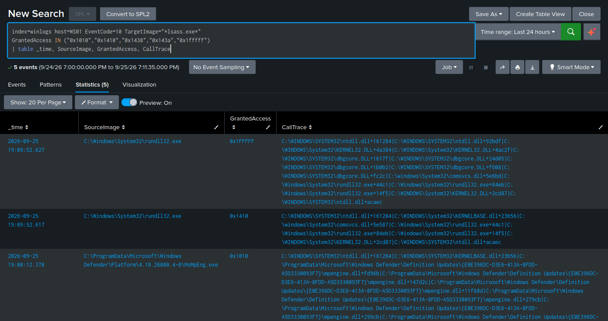

# LSASS Credential Access — T1003.001

**Tactic:** Credential Access · **MITRE ATT&CK:** [T1003.001](https://attack.mitre.org/techniques/T1003/001/)

## Technique

The LSASS process holds authentication material in memory. Tooling that reads LSASS memory can
extract credentials for reuse. Because any read requires **opening a handle to LSASS**, that
handle request is the detection opportunity — legitimate access to LSASS is rare and comes from
a known, small set of Windows processes.

## The attack

Run in the lab with Atomic Red Team, using the comsvcs.dll minidump method (a living-off-the-land
technique that uses a signed Windows DLL rather than an external tool):

```powershell
Invoke-AtomicTest T1003.001 -TestNumbers 2
```

An important observation: on a hardened Windows 11 host, **LSA Protection (RunAsPPL) blocked the
access** before a handle could be opened — the OS denied it at the API level and no dump was
produced. That is the control working as designed. To capture the detection signal for
development, RunAsPPL was temporarily disabled (and re-enabled afterward).

## The evidence

**Sysmon Event 10** (ProcessAccess) records the access to `lsass.exe`:

| Field | Meaning |
|-------|---------|
| `SourceImage` | the process that opened LSASS (e.g. `rundll32.exe` for the comsvcs method) |
| `GrantedAccess` | the access mask requested — `0x1010`, `0x1410`, `0x1fffff` (full) indicate read-for-dump |
| `CallTrace` | the code path — reveals the debug/minidump libraries used |

The `CallTrace` is the strongest signal: the comsvcs method loads `comsvcs.dll` and `dbgcore.dll`,
which appear in the call stack. Legitimate LSASS access does not go through those minidump
libraries.

## The detection

Keyed on the dumping libraries in the call trace — this describes the *technique* rather than
trying to enumerate every legitimate accessor:

```spl
index=winlogs EventCode=10 TargetImage="*lsass.exe*"
(CallTrace="*dbgcore*" OR CallTrace="*comsvcs*" OR CallTrace="*dbghelp*")
| table _time, SourceImage, GrantedAccess, CallTrace
```

## False positives and tuning

- **Windows Defender** (`MsMpEng.exe`) legitimately reads LSASS to scan it — at the API level
  this looks identical to the attack, so it must be distinguished by the accessing process.
- The first exclusion used an exact path (`C:\Windows\system32\MsMpEng.exe`) and **still
  false-positived**, because Defender actually runs from a versioned
  `C:\ProgramData\Microsoft\Windows Defender\Platform\<version>\` path. The fix was to match on
  the **filename** (`condition="image"`) rather than the full path, so it survives Defender's
  version updates. Exact-path exclusions are brittle for anything that self-updates its location.
- Keying the detection on `CallTrace` (the minidump libraries) rather than deny-listing
  accessors is the more robust design: Defender's scanning doesn't go through those libraries,
  so it falls away naturally.

## Config gap found

Sysmon **Event 10 is disabled by default** in the SwiftOnSecurity config (`ProcessAccess` with
an empty `include` block logs nothing — it's high-volume, so it's off unless you need it). LSASS
access was completely invisible until the config was extended to monitor `lsass.exe` as a target,
with the legitimate Windows accessors excluded. This is the single most important credential
detection, and it was silent on a lab that otherwise "had Sysmon."

## Bonus signal — the preparation

Disabling LSA Protection writes to `HKLM\SYSTEM\CurrentControlSet\Control\Lsa\RunAsPPL`, which
Sysmon captures as **Event 13** (registry value set). Detecting an attacker's *preparation* to
enable dumping — even when the dump itself is later blocked — is a stronger position than relying
only on catching the payload.

## Alert configuration

Scheduled every 5 minutes, search window last 5 minutes, trigger once when results > 0,
throttle 3600s, shared in app.

---

## Evidence (live)

Sysmon Event 10 access to `lsass.exe` filtered on the dump-associated access masks. The
attacker's `rundll32.exe` (comsvcs minidump) shows `GrantedAccess 0x1FFFFF` with
`dbgcore.dll`/`comsvcs.dll` in the call trace; Windows Defender (`MsMpEng.exe`) is the one
benign accessor still visible:


