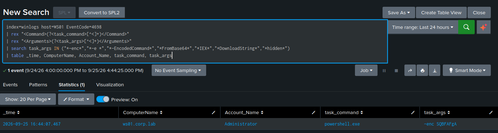

# Scheduled Task Persistence — T1053.005

**Tactic:** Persistence · **MITRE ATT&CK:** [T1053.005](https://attack.mitre.org/techniques/T1053/005/)

## Technique

Attackers create scheduled tasks to survive reboots and re-run their payload automatically. A
task triggered at boot or logon that launches a command interpreter (`cmd.exe`, `powershell.exe`)
is the classic pattern — the malware relaunches every time the machine starts.

The detection challenge here is the opposite of Kerberoasting: scheduled-task creation is
*constantly legitimate*. Installers, updaters, and Windows itself create tasks all day. So the
detection cannot fire on "a task was created" — it has to fire on *what the task runs*.

## The attack

Two variants were run. First, the Atomic Red Team test, which creates a boot-triggered task:

```powershell
Invoke-AtomicTest T1053.005 -TestNumbers 1
```

Its task runs `cmd.exe /c calc.exe` — deliberately benign (calc stands in for a real payload).
A well-tuned rule should treat this as benign, which is the point.

Second, a manual task simulating real malicious persistence — encoded PowerShell disguised as a
Windows component:

```powershell
schtasks /create /tn "WindowsUpdate" /tr "powershell.exe -enc SQBFAFgA" /sc onlogon /f
```

`SQBFAFgA` is base64 for `IEX`. Encoding is what makes this the malicious variant a detection
should catch.

## The evidence

Two independent signals:

- **Event 4698** (scheduled task created) — carries the full task definition as XML, including
  the command and arguments the task will run. Requires the `Audit Other Object Access Events`
  audit subcategory (see tuning note below).
- **Sysmon Event 1** — the `schtasks.exe` process with its full command line, and crucially the
  **parent process** that created it.

## The detection

The task command lives inside the 4698 event's XML, which sits in `_raw`, not a named field.
It's extracted with `rex`, then filtered on obfuscation indicators:

```spl
index=winlogs EventCode=4698
| rex "<Command>(?<task_command>[^<]+)</Command>"
| rex "<Arguments>(?<task_args>[^<]+)</Arguments>"
| search task_args IN ("*-enc*","*-e *","*-EncodedCommand*","*FromBase64*","*IEX*","*DownloadString*","*hidden*")
| table _time, ComputerName, Account_Name, task_command, task_args
```

This fires on the `WindowsUpdate` task (encoded PowerShell) and correctly stays silent on the
benign `cmd.exe /c calc.exe` task — the difference between a detection and a noise generator.

## False positives and tuning

Two approaches were compared:

1. **Interpreter list** — fire on any task running `cmd.exe`, `powershell.exe`, `rundll32.exe`,
   etc. Catches more, but false-positives heavily: legitimate software schedules these
   constantly. Would require correlating with the Sysmon **parent process** to separate an
   installer-created task from a malware-created one.
2. **Obfuscation indicators** (the rule above) — fire on encoded/fileless markers in the task's
   arguments. Near-zero false positives, because legitimate software essentially never schedules
   base64-encoded PowerShell. This is the rule that was saved.

The general principle: **allow-list the technique** (the specific malicious shape) rather than
**deny-list the noise** (every legitimate process).

## Config gap found

Event 4698 was silent at first. The `Audit Other Object Access Events` subcategory — separate
from the other audit policies and off by default — had to be enabled in the GPO before
scheduled-task creation was logged at all. A detection is only as good as the logging beneath it.

## Second signal

When the task runs its encoded payload, **Event 4104** (PowerShell script block logging) captures
the *decoded* command. So even if the 4698 obfuscation filter were evaded, the decoded intent is
caught at execution time by a second, independent data source.

## Alert configuration

Scheduled every 5 minutes, search window last 5 minutes, trigger once when results > 0,
throttle 3600s, shared in app.

---

## Evidence (live)

The high-fidelity rule firing on a malicious task — `svc-sql` creating a task named
`WindowsUpdate` that runs encoded PowerShell (`-enc SQBFAFgA`), extracted from the 4698
task XML:


