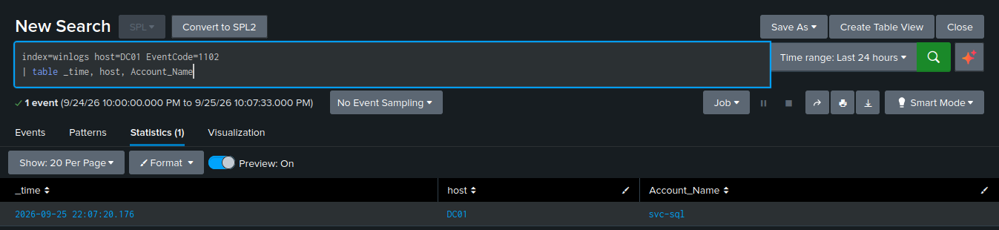

# Event Log Clearing — T1070.001

**Tactic:** Defense Evasion · **MITRE ATT&CK:** [T1070.001](https://attack.mitre.org/techniques/T1070/001/)

## Technique

After an intrusion, attackers clear the Windows event logs to destroy evidence. But clearing a
log *itself* generates an event — and if that event has already been forwarded off the machine to
a SIEM, the destruction is futile. This detection is the clearest demonstration of why
centralized logging matters.

## The attack

Run directly (a single command — the log-clear technique needs no tooling):

```powershell
# 104 — clears the Application log (safe)
wevtutil cl Application

# 1102 — clears the Security log, the marquee signal
Clear-EventLog -LogName Security
```

Both are safe on a lab box because the forwarder has already shipped every event to Splunk. That
is exactly the point being demonstrated.

## The evidence

- **Event 1102** — "the audit log was cleared" — written to the Security log at the moment it is
  cleared. It is often the *first* entry in the freshly-cleared log: the act of covering tracks is
  the first footprint in the clean snow.
- **Event 104** — a different (non-Security) log channel was cleared.
- Optionally **Sysmon Event 1** captures the method (`wevtutil.exe` or `Clear-EventLog`).

## The detection

```spl
index=winlogs (EventCode=1102 OR EventCode=104)
| table _time, host, EventCode, Account_Name
```

No host filter — this should fire on **every** host, and an event log cleared on the domain
controller is a five-alarm event.

## False positives and tuning

This is a **fire-on-sight** detection and needs essentially no tuning. Clearing the Security log
is almost never a legitimate action — administrators have no routine reason to do it. This is a
deliberate contrast to the scheduled-task detection, which needed heavy filtering to be usable.

Having both in a portfolio shows the full range: a detection that must be carefully tuned to
separate signal from noise, and one that is pure signal. Knowing which is which — and not
over-tuning a high-confidence alert — is part of the craft.

## Why it matters

The attacker cleared the logs on the most important machine in the domain, and it changed
nothing: the evidence was already off the box, in the SIEM, beyond their reach. This is the whole
argument for centralized logging in one action.

## Alert configuration

Scheduled every 5 minutes, search window last 5 minutes, trigger once when results > 0,
shared in app. A short throttle is optional — log clearing is rare enough that every instance
is worth surfacing.

---

## Evidence (live)

Event 1102 on the domain controller — the Security log cleared by `svc-sql`, the final
stage of the attack chain. The clearing event was forwarded to Splunk before the attacker
could benefit from wiping the local log:


