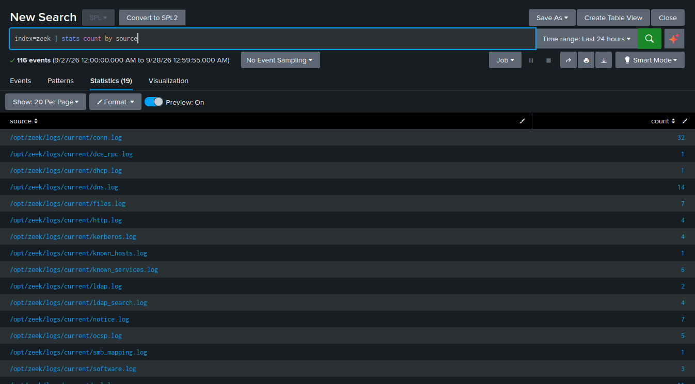
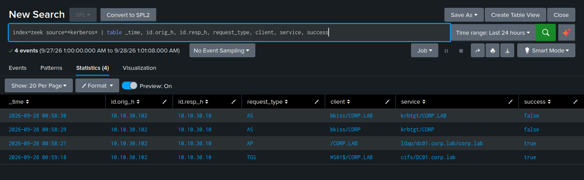
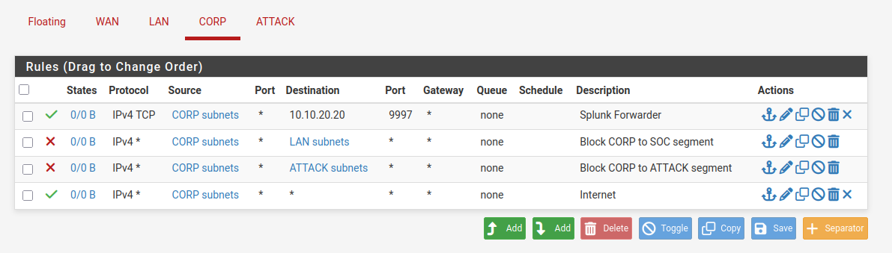

# Network Visibility — Zeek Sensor

Adding a network sensor so the lab sees traffic *on the wire*, not just events *on the hosts*.
This closes a real gap: the entire lateral movement from WS01 to the domain controller happened
inside one segment and never crossed the firewall, so endpoint logs were the only witness —
until now.

## Design

A dedicated Ubuntu sensor with **two NICs**, mirroring how a real network tap works:

- **NIC 1 — management** (VMnet2 / SOC, `10.10.20.30`): how the box is reached and how it
  forwards logs to Splunk.
- **NIC 2 — sniffing** (VMnet3 / Corporate, **no IP**, promiscuous mode): a passive listener on
  the segment where the endpoints, AD traffic, and lateral movement live. No address means it
  can't be reached or attacked from the segment it watches — it only listens.

Zeek runs on the sensor, turning raw packets into structured protocol logs (connections, DNS,
HTTP, TLS, Kerberos, LDAP, SMB), which a Universal Forwarder ships to the Splunk `zeek` index in
JSON.

```
VMnet3 (Corp) traffic ──mirror──> ens37 (promisc, no IP) ──> Zeek ──> JSON logs
                                                                         │
                                        Universal Forwarder (TCP 9997) ──┘──> Splunk  [zeek index]
```

## What it captures

19 Zeek log types flowing into Splunk, including the Active Directory protocols — `kerberos.log`,
`ldap.log`, `smb_mapping.log`, `dce_rpc.log`:



Zeek decodes Kerberos on the wire — the AS (ticket-granting), AP, and TGS (service-ticket)
exchanges, with the requesting client and target service visible. This is the network-side view
of the same authentication activity the endpoint 4769 events capture:



## Build notes (gotchas worth keeping)

- **Checksum offloading** — in a VM the NIC offloads checksum calculation, so Zeek sees
  "invalid" checksums and discards packets by default, producing empty logs. Fixed permanently
  with `redef ignore_checksums = T;` in `local.zeek` (the config equivalent of `zeek -C`).
- **JSON output** — `@load policy/tuning/json-logs.zeek` makes every log a JSON object per line,
  which Splunk field-extracts automatically. Far cleaner than Zeek's default TSV.
- **Promiscuous mode resets on reboot** — Zeek re-enables it via `zeekctl`, but it's worth
  confirming after a restart.
- **Forwarder permissions** — Zeek writes logs root-owned and restrictive, so the Universal
  Forwarder had to run as root to read them (same least-privilege-vs-just-works tradeoff as the
  Windows forwarder running as Local System).

## The capture-loss finding

The most valuable lesson from the sensor. A virtual promiscuous interface is **not** a hardware
SPAN port or TAP — it's software copying frames, and it drops packets under load. Zeek measures
this itself in `capture_loss.log` (inferred from TCP ACKs for data it never saw):

- Quiet periods: ~0.5% loss
- Active traffic: **~10%**, higher on bursts

The practical consequence: an attempt to catch a Kerberoast *on the wire* repeatedly failed —
the sensor caught the initial AS request but dropped the TGS packet that carries the roast. The
**endpoint** detection (4769) caught it every time, because that event is generated on the DC
itself, with nothing to drop.

This is the real-world takeaway, and it cuts both ways with the attack-chain reconstruction
(where a 4624 was missing its source IP and the 4769 filled the gap): **no single sensor is
complete.** Network sensors see traffic, not truth. Endpoint telemetry is the reliable backbone;
network telemetry is the complement that adds context the endpoint can't — and mature detection
correlates both rather than trusting either alone.

## Firewall segmentation

Alongside the sensor, the lab's `TEMP allow all` firewall rules were replaced with real
least-privilege policy. The key ruleset is on the corporate segment: endpoints may forward logs
to Splunk and reach the internet, but cannot reach the rest of the SOC segment (the jump box, the
sensor's management interface) or the attack segment.



Rule order matters — the Splunk-forwarder allow sits above the SOC block, so telemetry survives
even as lateral access is denied. Verified: a compromised endpoint can still ship logs
(`TcpTestSucceeded` on 9997) but can no longer reach the jump box. This is **log isolation** — an
attacker who owns an endpoint cannot pivot to the monitoring infrastructure or tamper with the
evidence store.
